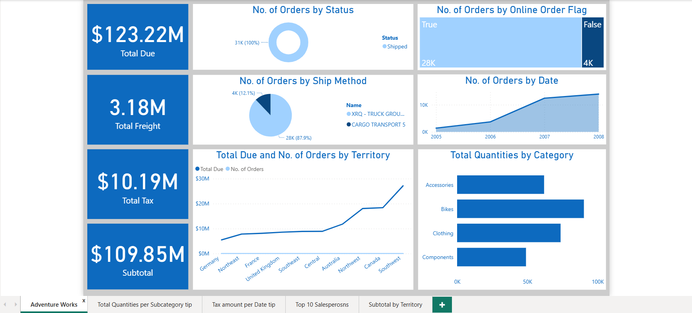
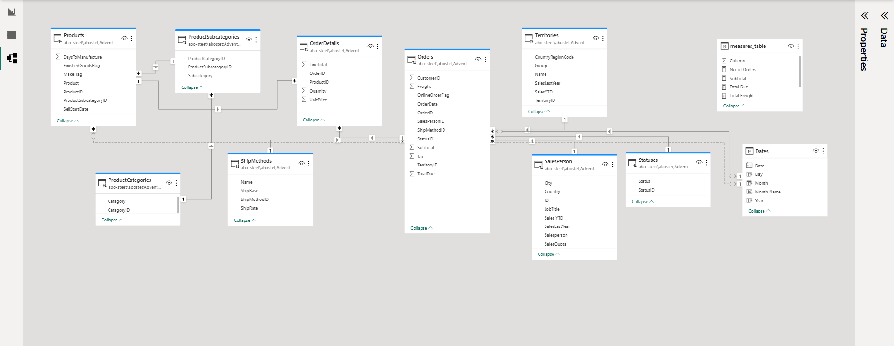

# Adventure Works Dashboard 📊

> A multi-page Power BI dashboard connected to a SQL Server database, built on a 10-table data model using DirectQuery mode to analyze sales performance, product quantities, and territory revenue for Adventure Works.

---

## 📌 Overview

Adventure Works is a Microsoft sample OLTP database representing a bicycle manufacturing and sales company. This dashboard was built to give sales managers and business stakeholders a clear, interactive view of operations, from high-level KPIs down to individual salesperson performance and territory breakdowns.

The project goes beyond basic reporting. It uses **DirectQuery** for live data connectivity, a custom **DAX measures table**, calculated **Status** and **Dates** tables, and advanced Power BI features including Drill Down, Drill Through, and Tooltip pages.

---

## 🖼️ Dashboard Preview

### Main Dashboard

### Data Model

---

## 📋 Dashboard Pages

| Page | Description |
|------|-------------|
| Adventure Works | Main overview with KPI cards, order analysis, and territory performance |
| Total Quantities per Subcategory | Tooltip page showing product quantity breakdown by subcategory |
| Tax Amount per Date | Tooltip page showing monthly tax trends |
| Top 10 Salespersons | Drill Through page with salesperson ranking by orders and revenue |
| Subtotal by Territory | Territory-level subtotal comparison with region filter |

---

## 🔍 Key Insights

- Total revenue across all territories reached **$123.22M** with **$109.85M** subtotal
- **100% of orders** were shipped with no cancellations or returns recorded
- **Southwest** leads all territories with **$24.2M** in subtotal, followed by Canada at **$16.4M**
- **Road Bikes** dominate product quantities while **Accessories** have the highest subcategory count
- The **United States** accounts for the majority of top salesperson orders with **2,201** out of 3,229 total
- Order volume grew steadily from 2005, **peaking in 2007-2008**

---

## 🛠️ Data Model

The dashboard is built on a **10-table star schema** connecting SQL Server tables:

| Table | Source | Description |
|-------|--------|-------------|
| Orders | `Sales.SalesOrderHeader` | Main fact table with order details |
| OrderDetails | `Sales.SalesOrderDetail` | Line-level order items |
| SalesPerson | `Sales.vSalesPerson` | Salesperson view with YTD data |
| Territories | `Sales.SalesTerritory` | Geographic territory data |
| ShipMethods | `Purchasing.ShipMethod` | Shipping method details |
| Products | `Production.Product` | Product catalog |
| ProductSubcategories | `Production.ProductSubcategory` | Product subcategory mapping |
| ProductCategories | `Production.ProductCategory` | Top-level category grouping |
| Statuses | DAX | Calculated from `ufnGetSalesOrderStatusText` |
| Dates | DAX | Custom date table for time intelligence |

---

## ⚙️ DAX Measures

All measures are organized in a dedicated **measures_table**:

| Measure | Description |
|---------|-------------|
| `# Orders` | Total count of sales orders |
| `Total SubTotal` | Sum of order subtotals before tax and freight |
| `Total Tax` | Total tax amount across all orders |
| `Total Freight` | Total shipping cost across all orders |
| `Total Due` | Final amount due including tax and freight |
| `# Qty` | Total product quantity sold |

---

## 🔧 Advanced Features

- **DirectQuery Mode:** Live connection to SQL Server, no data import
- **Drill Down:** Navigate from category to subcategory to product level
- **Drill Through:** Jump to the Top 10 Salespersons page from any visual
- **Tooltip Pages:** Hover to reveal subcategory quantities and monthly tax charts

---

## 🛠️ Tools and Techniques

| Tool | Usage |
|------|-------|
| **Power BI Desktop** | Dashboard design and development |
| **SQL Server** | Data source via DirectQuery |
| **DAX** | Custom measures, Status table, and Dates table |
| **Power Query** | Table renaming, column cleanup, and transformations |

**Visualizations used:** KPI cards, Donut chart, Pie chart, Area chart, Bar charts, Line chart, Matrix table, Decomposition tree

---

## 📁 Database

This project uses the **AdventureWorks** sample database provided by Microsoft.

🔗 [Download AdventureWorks Database](https://docs.microsoft.com/en-us/sql/samples/adventureworks-install-configure?view=sql-server-ver15&tabs=ssms)
